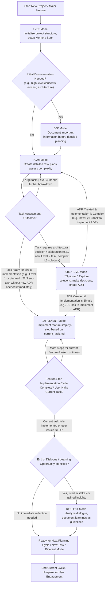

# 2MB: Modes-based Memory Bank Agentic Workflow

## Introduction

The primary goal of this framework is to enable the agent to handle complex coding tasks methodically and efficiently by leveraging a persistent "Memory Bank" and operating in distinct "Modes".

These rules are intended to be used by an AI agent, potentially within an AI-first development environment like the Cursor IDE, or as a blueprint for a custom AI coding assistant.

## Core Concepts

### 1. The Memory Bank
The **Memory Bank** is a crucial component of this workflow. It's a dedicated directory structure (`./memory-bank/`) within each project that acts as the AI's persistent knowledge base and working memory for that specific project.

* **Purpose:** To store all relevant project information, including the project's goals, architecture, technical specifications, decisions made (ADRs), task plans, current task context, and learned guidelines.
* **Benefits:** Enables continuity between sessions, provides deep context for decision-making, facilitates complex task management, and allows the AI to adapt to project-specific conventions by referencing documented guidelines.

### 2. Modes-Based Workflow
The agent operates using a **Modes-Based Workflow**. Each mode defines a specific set of objectives, rules, and allowed actions, ensuring that the AI approaches different types of tasks with the appropriate focus and methodology.

* **Purpose:** To break down complex software development activities into manageable, focused operational states. This provides structure, improves predictability, and allows for specialized instructions for different tasks (e.g., planning, coding, reflecting).
* **Selection:** Modes are typically activated by the user via specific keywords (e.g., `PLAN`, `IMPLEMENT`). The AI must be in a defined mode to operate.
* **Adherence:** While in a specific mode, the agent must strictly adhere to the rules defined in that mode's corresponding `.mdc` rule file.

## Setting Up (Example: Cursor IDE)

This rules framework is designed for an AI agent. If you are using the **Cursor IDE** (an AI-first code editor), these rules can serve as a sophisticated prompt structure or operational guide for its integrated AI capabilities, or for a custom AI agent you might develop based on these principles.

* **Cursor IDE Installation:** For information on installing and using the Cursor IDE, please refer to their official website: [https://cursor.sh/](https://cursor.sh/)
* **Agent Configuration:** Create a `./.cursor/rules/` directory and copy the `.mdc` rule files from this repository into it.
* **Project Initialization:** The project must be initialized with `INIT` command.

## The Memory Bank Structure (`./memory-bank/`)

The `./memory-bank/` folder is located at the root of the project. It **MUST** be initialized before most operations. Its standard structure includes:

* `./memory-bank/project_brief.md`: High-level project description and goals.
* `./memory-bank/architecture/`: Contains architectural information, including an `index.md` and specific Architectural Decision Records (ADRs).
* `./memory-bank/tech/`: Holds details about the project's technical stack, standards, and guidelines.
    * `index.md`: The central index for all technical standards, coding conventions, and specific guidelines, including a mandatory "Common Guidelines" section. This file links to other detailed guideline documents within this folder.
* `./memory-bank/project_plan.md`: The project development plan, including tasks, their status, complexity levels, and breakdown of Level 3 tasks.
* `./memory-bank/current_task.md`: Detailed description and actionable steps for the task the agent is currently focused on.

(For the precise roles and AI interaction protocols for each file, please refer to the main agent rules and specific mode rule files.)

## Operational Framework: Workflow and Modes

### General Workflow
1.  **Initialization:** The agent ensures the Memory Bank is initialized at the start of a project or task.
2.  **Mode Selection:** Operations begin with user selection of a mode via a keyword. If no mode is chosen, the agent prompts for one.
3.  **Rule Adherence:** The agent loads and strictly follows the rules from the active mode's `.mdc` file (typically found in `./.cursor/rules/`).
4.  **Memory Bank Interaction:** All modes use the Memory Bank for context and to record outputs.

### Defined Modes
The following modes provide structured ways for the agent to operate. For detailed rules and procedures for each mode, please consult the linked `.mdc` files.

* **`INIT` Mode**
    * **Keyword:** `INIT`
    * **Purpose:** To initialize the project's Memory Bank.
    * **Details:** See [`init.mdc`](./.cursor/rules/modes/init.mdc)

* **`DOC` Mode**
    * **Keyword:** `DOC`
    * **Purpose:** To assist the user in articulating, refining, and documenting information, patterns, rules, or other project knowledge into the Memory Bank.
    * **Details:** See [`doc.mdc`](./.cursor/rules/modes/doc.mdc)

* **`PLAN` Mode**
    * **Keyword:** `PLAN`
    * **Purpose:** To define, evaluate task complexity, and break down tasks for execution. It does not involve code modification.
    * **Details:** See [`plan.mdc`](./.cursor/rules/modes/plan.mdc)

* **`CREATIVE` Mode**
    * **Keyword:** `CREATIVE`
    * **Purpose:** To explore solutions for complex tasks, facilitate architectural decision-making, document decisions as ADRs, and then assess the implementation complexity of the chosen solution. It does not involve code modification.
    * **Details:** See [`creative.mdc`](./.cursor/rules/modes/creative.mdc)

* **`IMPLEMENT` Mode**
    * **Keyword:** `IMPLEMENT`
    * **Purpose:** To write or modify **production source code** for one specific step of the current task, strictly adhering to all guidelines.
    * **Details:** See [`implement.mdc`](./.cursor/rules/modes/implement.mdc)

* **`REFLECT` Mode**
    * **Keyword:** `REFLECT`
    * **Purpose:** To analyze past interactions, identify AI mistakes or suboptimal approaches, and, with user approval, document these learnings as new or updated **project guidelines** in `./memory-bank/tech/`.
    * **Details:** See [`reflect.mdc`](./.cursor/rules/modes/reflect.mdc)

### Task Complexity Levels
Tasks are categorized into different levels to guide planning and execution. This leveling is primarily based on the number of architectural decisions required:

* **Level 1:** Simple tasks with no architectural decisions.
* **Level 2:** Tasks requiring exactly one architectural decision.
* **Level 3:** Complex tasks requiring more than one architectural decision.

For detailed criteria, characteristics, and illustrative examples for each level, please refer to the **[Task Complexity Level Definitions rule document](./.cursor/rules/task-levels.mdc)**.